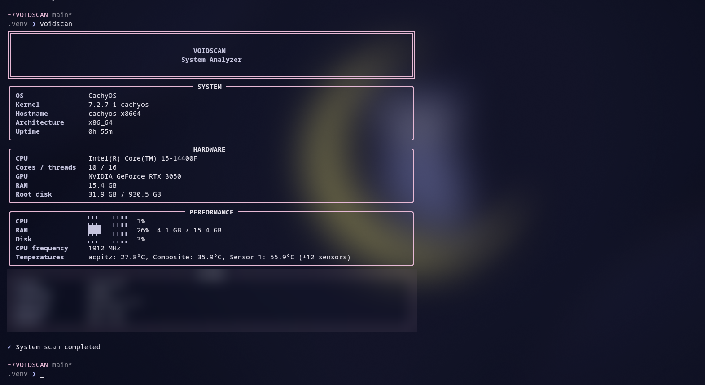

# VOIDSCAN

VOIDSCAN is a small, read-only Linux system analyzer. It presents host,
hardware, resource, and local network details in a clear terminal interface.
It is designed for Arch-based distributions such as CachyOS, Arch Linux, and
EndeavourOS, and degrades gracefully when optional details are unavailable.

## Features

- OS, distribution, kernel, hostname, architecture, and uptime
- CPU, core/thread counts, GPU, memory, and root filesystem details
- CPU/RAM/disk use, frequency, and available temperature sensors
- Active interface, local IP, and a brief download/upload throughput sample
- JSON report output; no public IP lookup, elevated access, or system changes

## Screenshot



## Requirements

- Linux and Python 3.9 or newer
- `psutil` and `rich` (installed automatically with the package)
- Optional: `nvidia-smi` for NVIDIA model detection

## Installation

```bash
git clone <repository-url>
cd VOIDSCAN
python3 -m venv .venv
source .venv/bin/activate
python -m pip install -e .
voidscan
```

## Usage

```bash
voidscan                 # Full terminal overview
voidscan --help          # Show available options
voidscan --version       # Show version
voidscan --hardware      # Hardware summary
voidscan --performance   # Current resource usage
voidscan --network       # Local network details
voidscan --report        # Write ./voidscan-report.json
```

The report has `system`, `hardware`, `performance`, and `network` objects. It
contains local network information only and never queries a public IP service.
Network throughput is sampled briefly during a scan, so a quiet connection can
show zero even while connected.

## Project structure

```text
src/voidscan/       CLI and collection/display modules
tests/              Basic unit tests
pyproject.toml      Package metadata and console entry point
requirements.txt    Runtime dependencies
```

## Contributing

See [CONTRIBUTING.md](CONTRIBUTING.md) for development steps and project
expectations.

## License

VOIDSCAN is released under the [MIT License](LICENSE).
